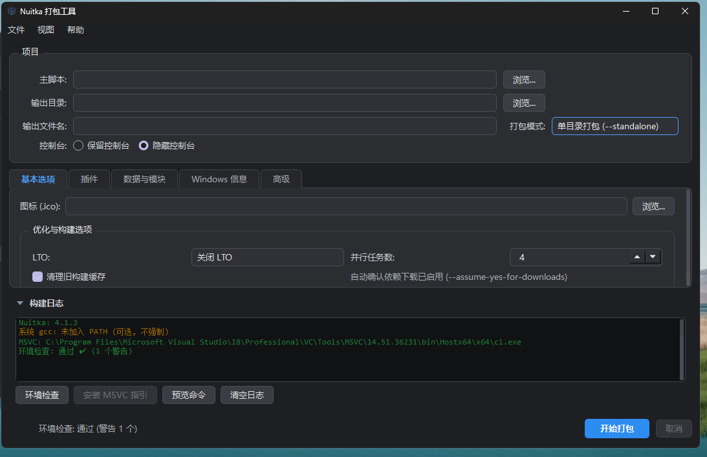
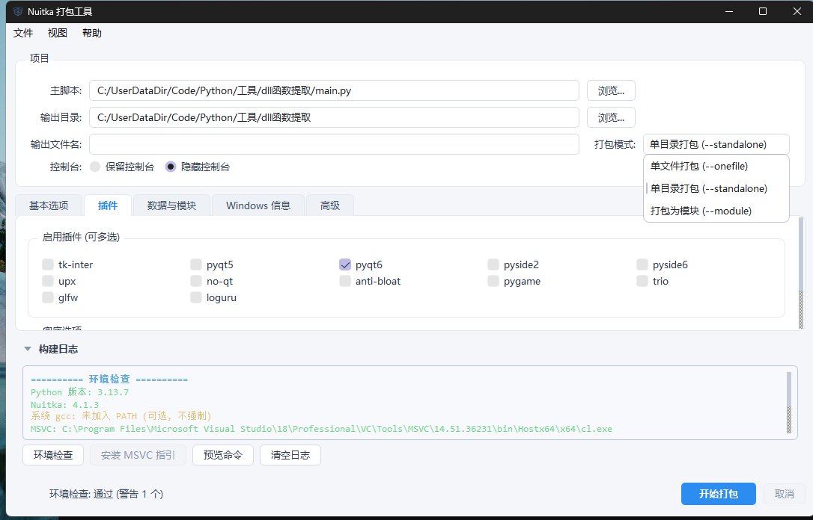

# NuitkaGUI

[Nuitka](https://nuitka.net/) 的图形化打包工具，基于 **PySide6**，把 Python 程序一键打包为 Windows / Linux / macOS 可执行文件。

[]()
[]()
[]()
[](LICENSE)
[](https://github.com/cc-Infiltration/NuitkaGUI/actions)

## 功能特性

### 打包选项
- **三种模式**：单文件 (`--onefile`)、单目录 (`--standalone`)、模块 (`--module`)
- **插件多选**：运行时自动发现当前 Nuitka 安装的全部内置插件（AST 静态解析 `plugin_name`，不执行插件代码；插件名白名单校验防注入），按「GUI / 压缩兼容 / 数据科学与机器学习 / 并发网络 / 内部高级」分组展示并附悬停说明；Nuitka 升级新增的插件自动出现在「其他」组，已移除的插件不再显示
- **数据与模块**：数据目录/文件（仅单文件 (`--onefile`) 模式下可填写，切换到其他模式自动停用并提示，已添加条目保留、切回即恢复；浏览即添加并自动以主脚本所在目录为项目根，计算资源相对路径填入「程序内」目标——同盘项目内保留子目录结构；项目外自动剥离 `..`；跨盘无法计算时提示并回退文件名；目标路径强制相对路径校验——拒绝盘符/绝对路径/`..`/通配符与引号类字符，检测目标冲突，从源头杜绝 Duplication 类打包失败）、包含包/模块、排除导入
- **Windows 元数据**：公司/产品名、文件/产品版本、描述、版权（版本号输入框限制为数字点分，自动清洗 `V` 前缀）
- **图标**：Windows 下嵌入 PE 图标（.ico），全平台打进产物供运行时加载任务栏图标
- **构建选项**：LTO 自动/开/关、并行任务数（`--jobs`）、清理旧构建缓存

### 环境检查与失败诊断
- 启动自动环境检查：Python 版本、Nuitka、C 编译器
- **MSVC 多版本检测**：vswhere JSON + 硬编码路径 + PATH + 自定义目录，按版本降序标记首选
- **MinGW64 一键下载**（Python ≤ 3.12）；Python 3.13+ 自动引导安装 MSVC
- Linux / macOS 检测 gcc / clang，未安装时给出对应发行版的安装命令
- UPX 勾选但未安装时选项淡红提示
- **失败自动诊断**：内置 17 类常见失败规则（缺编译器、插件名错误、版本号格式、数据路径不存在、磁盘空间、写入权限、Scons 锁超时等），给出针对性修复建议，并自动跳转选中日志中第一条错误行

### 使用体验
- **实时日志分级上色**：stderr 独立管道 + 行级智能识别（error 红 / warn 黄 / ok 绿），命令回显脱敏（路径仅显示文件名）
- **阶段进度**：下载→编译→链接→产物阶段映射，C 编译阶段叠加真实模块进度（x/y）
- **不卡顿**：打包 / 下载 / 环境检查均在后台线程，Qt 信号槽回传；取消时进程树杀死，无子进程残留
- **命令预览**：一键查看完整 Nuitka 命令，被拦截的 UI 已管控参数会列出并说明原因
- **亮/暗双主题**（QSS 热切换）、配置自动保存与恢复

### 安全加固
- `config.json` SHA-256 完整性校验 + 原子写入，防篡改
- 打包前对主脚本、图标做 TOCTOU 二次存在性校验
- 高级参数黑名单：25 个 UI 已管控的 flag 不允许被「附加参数」覆盖
- 日志脱敏：不泄露绝对路径、解释器位置与临时目录

## 界面预览

| 暗色主题 | 亮色主题 |
| --- | --- |
|  |  |

## 快速开始

### 环境要求

| 依赖 | 说明 |
|------|------|
| Python | 3.10+（3.13.7 已验证） |
| Nuitka | `>=4.2.1,<4.3.0`（见 requirements.txt） |
| PySide6 | `>=6.7.0`（见 requirements.txt） |
| C 编译器 | Python 3.13+ 需 MSVC；3.12 及以下首次打包自动下载 MinGW64 |

### 安装与运行

```bash
pip install -r requirements.txt
python main.py
```

> **C 编译器**：Python 3.13+ 需 MSVC（`winget install Microsoft.VisualStudio.2022.BuildTools`）；3.12 及以下首次打包时 Nuitka 会自动下载 MinGW64（工具已默认 `--assume-yes-for-downloads`）。

## 使用流程

1. **项目**：选择主脚本 `.py`、输出目录、输出文件名、打包模式、是否保留控制台
2. **基本选项**：选择图标，配置 LTO、并行任务数
3. **插件 / 数据与模块 / Windows 信息 / 高级**：按需配置（页签懒加载，切换时才构建）
4. 点击 **开始打包**；失败时按日志区「诊断 / 建议」修复后重试

配置保存在 `~/.nuitka_gui/config.json`，每次打包前自动保存，下次启动自动恢复。

## 打包本项目

Windows（PowerShell）：

```powershell
python -m nuitka --standalone --onefile --enable-plugin=pyside6 `
  --windows-console-mode=disable --windows-icon-from-ico=a.ico `
  --include-data-files=a.ico=a.ico --include-data-dir=styles=styles `
  --output-filename=NuitkaGUI --output-dir=dist --jobs=4 `
  --assume-yes-for-downloads main.py
```

Linux / macOS：

```bash
python -m nuitka --standalone --onefile --enable-plugin=pyside6 \
  --include-data-dir=styles=styles \
  --output-filename=NuitkaGUI --output-dir=dist --jobs=4 \
  --assume-yes-for-downloads main.py
```

> `--include-data-dir=styles=styles` 必须保留，否则 `styles/*.qss` 不会被打包，运行时会切换不了主题。

生成安装包（需 [Inno Setup](https://jrsoftware.org/isinfo.php)）：

```powershell
ISCC.exe installer\NuitkaGUI.iss
```

产物为 `dist\NuitkaGUI_Setup_v1.1.0.exe`。

## 项目结构

```text
NuitkaGUI/
├── main.py                 # 入口
├── modules/
│   ├── app.py              # GUI 主界面（PySide6）
│   ├── builder.py          # Nuitka 命令构造与执行
│   ├── config.py           # 配置持久化（SHA-256 + 原子写入）
│   └── deps.py             # 环境检查 / 编译器探测 / MinGW64 下载
├── styles/                 # 亮色 / 暗色主题 QSS
├── installer/              # Inno Setup 安装脚本
├── .github/workflows/      # CI：Windows+GCC / Windows+MSVC / Ubuntu+gcc 三平台构建
├── MdImages/               # README 截图
├── a.ico                   # 应用图标
└── requirements.txt
```

## 常见问题

1. **Scons 编译锁超时（sconslockfailure）？**

   关掉其他打包窗口；仍失败则删除缓存目录（Windows: `%LOCALAPPDATA%\Nuitka`，或本工具重定向的 `output_dir/.nuitka_cache`）后重试。

2. **日志里的路径只显示文件名？**

   命令回显默认脱敏，防止泄露项目位置。

## CI

GitHub Actions 在三个平台执行完整构建与冒烟测试：

| 任务 | 平台 | Python | 编译器 |
| --- | --- | --- | --- |
| Windows+GCC | windows-latest | 3.12 | MSYS2 MinGW64 |
| Windows+VC | windows-latest | 3.13 | MSVC（VsDevCmd 注入环境） |
| Ubuntu+gcc | ubuntu-24.04 | 3.13 | 系统 gcc |

## 更新日志

[详细日志](https://github.com/cc-Infiltration/NuitkaGUI/releases)

## License

[MIT](LICENSE)
